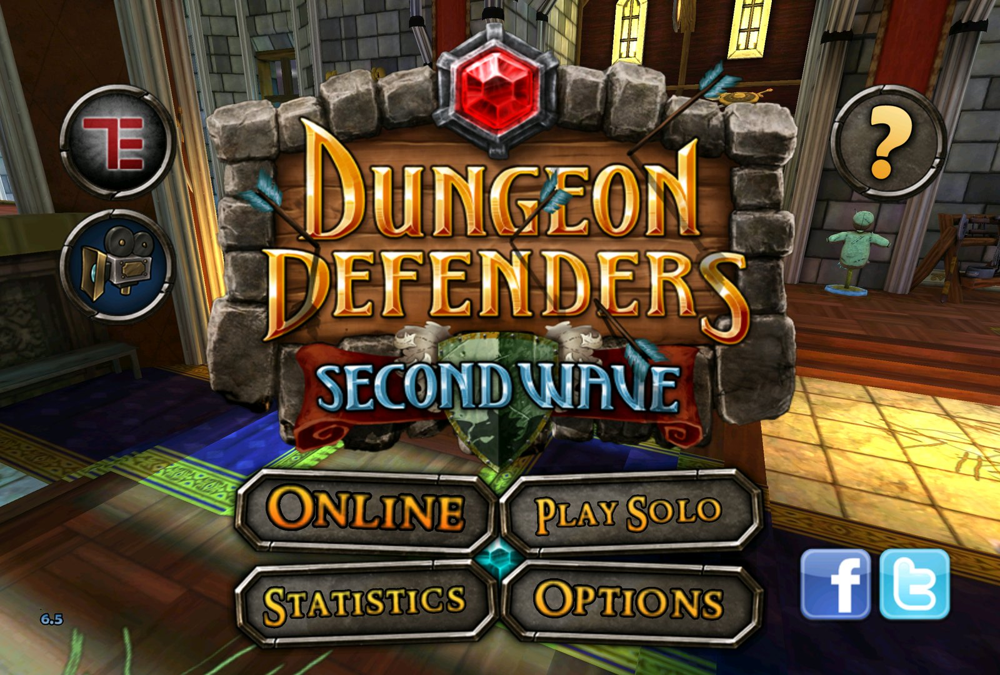
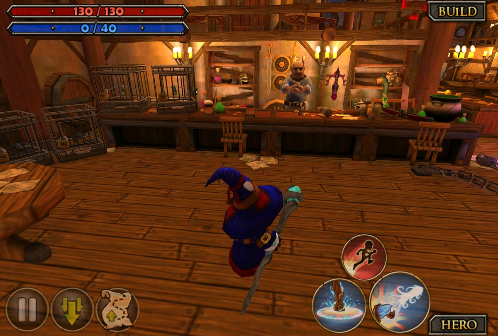
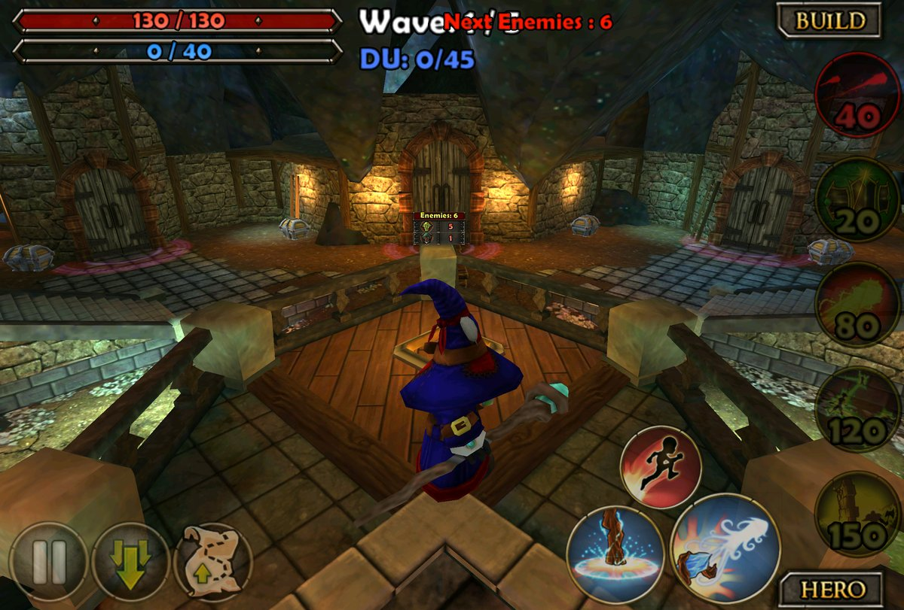
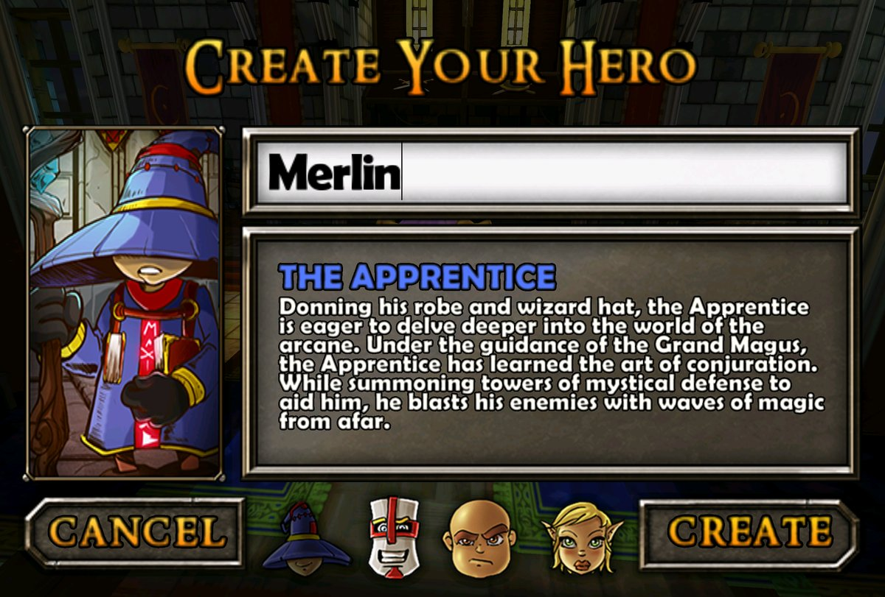
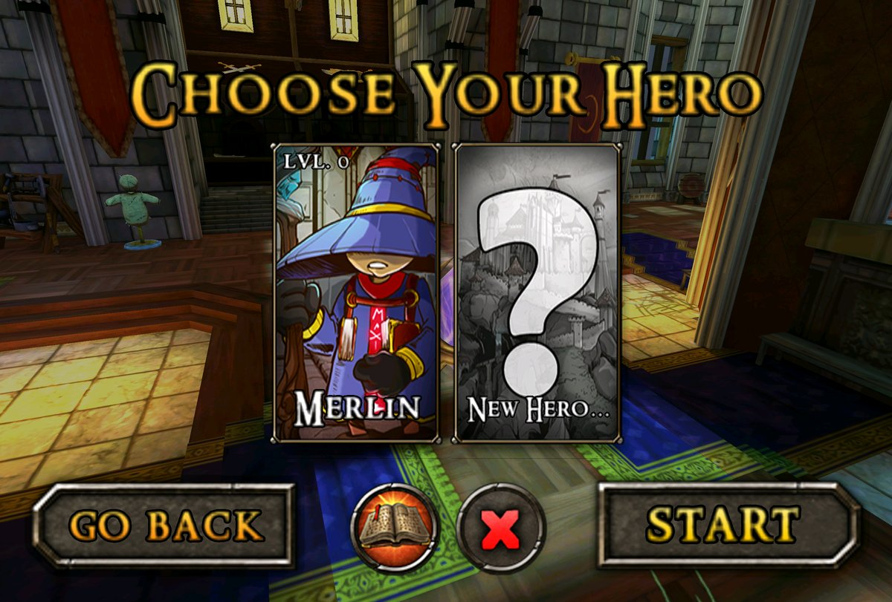
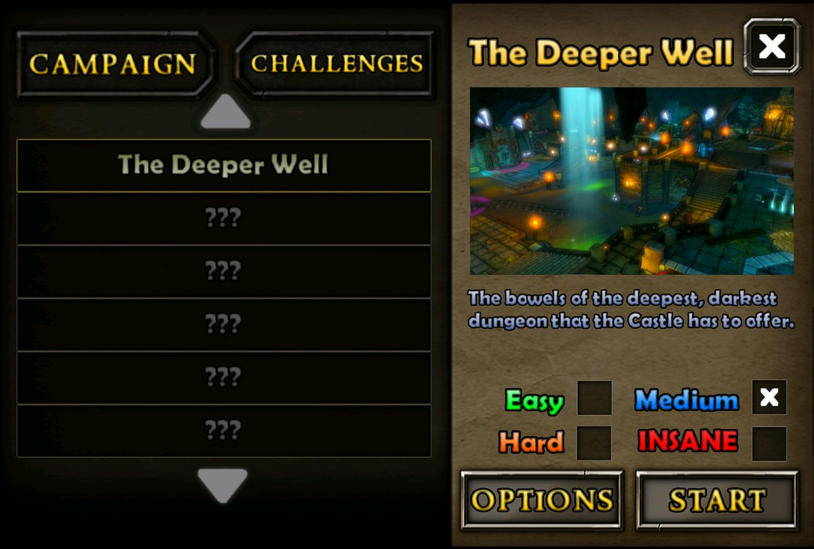
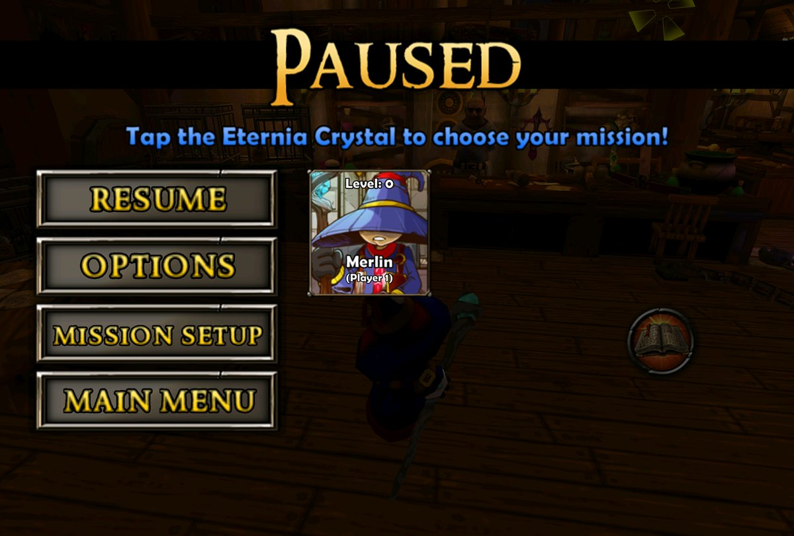
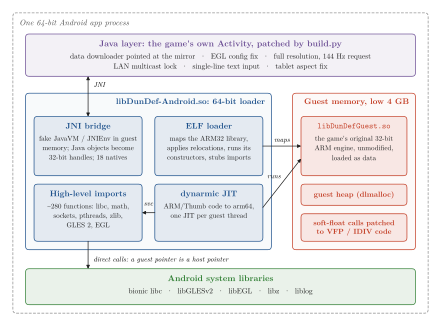
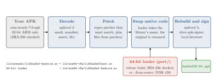

<div align="center">

# Dungeon Defenders: Second Wave on 64-bit Android

Runs the original 2012 Android release of *Dungeon Defenders: Second Wave* on modern Android,
including 64-bit-only chips that cannot execute 32-bit ARM code at all, through an ARM32 → ARM64 JIT loader.
**Bring your own APK.**

[](#getting-started)
[](#architecture)
[](#getting-started)
[](LICENSE)

</div>

> [!IMPORTANT]
> **This repository contains no game code or assets.** You need your own copy of the original
> APK (`com.trendy.ddapp`, version 7.6). `build.py` patches it on your machine and produces a new
> APK you can sideload.

<p align="center">
  
  <br>
  <em>The original 2012 game on a 64-bit-only Android 15 device: full native resolution, uncapped frame rate.</em>
</p>

---

## Overview

*Dungeon Defenders: Second Wave* was released for Android in 2012 as a 32-bit ARM (armeabi) app.
It stopped working on current devices for several independent reasons: recent CPUs such as the
Snapdragon 8 Elite, Dimensity 9300 and Google Tensor G2 have no 32-bit mode, Android 14+ refuses
its target SDK, its download servers are gone, and modern GPUs no longer offer the framebuffer
format it asks for.

This project fixes all of them while leaving the game's engine library file unmodified (the
loader patches it only in memory):

- a **64-bit loader** (`port/`) takes the place of the game's native library and runs the
  untouched 32-bit original through the [dynarmic](https://github.com/azahar-emu/dynarmic) JIT;
- a **build script** (`build.py`) decodes your APK, applies small, commented patches to its Java
  side, swaps in the loader and signs the result.

It works on Windows, macOS and Linux and needs only Java and Python.

## Features

**Table 1.** What stopped the game from running on modern Android, and what this project does about it.

| Problem on modern Android | Fix |
|---|---|
| The game's engine is a 32-bit ARM library; new CPUs have no 32-bit mode | A 64-bit loader runs it through an ARM32 → ARM64 JIT ([Architecture](#architecture)) |
| `targetSdkVersion 11`: Android 14+ refuses to install it | targetSdk 28, minSdk 24 |
| Trendy's download servers are gone | The downloader points at NVIDIA's mirror (HTTPS) |
| The mirror answers with chunked transfers and the 2012 downloader treats "unknown length" as an error | Responses are buffered (`BufferedHttpEntity`, pieces are ≤ 5 MB) |
| Old Market in-app billing throws on modern Android | The exception is caught |
| Modern GPUs (e.g. Adreno 7xx/8xx) expose no RGB565 EGL configs, so the game reported "OpenGL initialization failed" | The closest EGL config is always accepted |
| Rendered at ~50% resolution with a 60 fps engine cap | Full resolution, cap raised to 145 fps, 144 Hz display mode requested, immersive full screen |
| Phones drop Wi-Fi broadcast packets, so LAN games are hard to find | The app holds a `MulticastLock` |
| On touch keyboards, Enter typed a newline into hero/game names, and closing the keyboard discarded the text | Single-line field with a "Done" key; Done or closing the keyboard keeps the name |
| The 48 px legacy icon shows up small on a white plate | Adaptive icon built from the game's own 170 px artwork |
| On tablets (7" or more, the game's own test) the HUD only fits near 3:2: at 7:5 (e.g. OnePlus Pad 3) BUILD/HERO fall off the right edge, at 16:10 the bottom row is cut too | On tablets the window is sized to 1.48:1 and centered, with black bars top/bottom or left/right |
| On phones wider than 16:9 (18:9 to 21:9) the phone HUD is left-aligned: BUILD/HERO and the action buttons sit mid-screen instead of at the right edge | The loader patches the engine's layout code to center the HUD; the scene stays full screen |

### Screenshots

<table>
  <tr>
    <td align="center"><br><em>Tavern hub</em></td>
    <td align="center"><br><em>The Deeper Well: build phase</em></td>
  </tr>
  <tr>
    <td align="center"><br><em>Hero creation</em></td>
    <td align="center"><br><em>Hero selection</em></td>
  </tr>
  <tr>
    <td align="center"><br><em>Mission select</em></td>
    <td align="center"><br><em>Pause menu</em></td>
  </tr>
</table>

## Architecture

`port/` builds a 64-bit `libDunDef-Android.so` that replaces the game's library. The untouched
32-bit original is shipped next to it as `libDunDefGuest.so`, and the Java side keeps calling
the same library name it always did.

<p align="center"></p>

**Figure 1.** The loader inside the app process. The original engine lives in a guest arena in the
low 4 GB of the address space, so guest pointers are valid host pointers. dynarmic executes its
code; every call it makes to an imported function exits the JIT through an `svc` and is served by
a host implementation, which in most cases forwards it directly to the Android system library.

- **Memory.** A ~1.25 GB arena is reserved in a free gap of the process's low 4 GB. Guest
  pointers are host pointers, so most calls into libc and OpenGL pass straight through.
  `dlmalloc` serves the guest heap from that arena.
- **ELF loader.** Maps the ARM32 library, applies its relocations and runs its static
  constructors. Every imported function becomes a two-instruction `svc #n; bx lr` stub.
- **CPU.** [dynarmic](https://github.com/azahar-emu/dynarmic) JIT-compiles ARM/Thumb code to
  arm64 (or x86_64 for the emulator), with one JIT per guest thread. Leaf imports run directly
  inside the JIT's SVC callback. Calls that can re-enter the guest (JNI, `qsort`) leave the JIT
  first and save and restore the context.
- **High-level emulation** of what the library imports (~280 functions): libc, math, stdio,
  sockets, pthreads (old bionic's 4-byte mutexes and condvars are mapped to real ones), zlib,
  OpenGL ES 2 and EGL. Where 32-bit and 64-bit layouts differ (`struct stat`, `tm`, `timeval`,
  `addrinfo`, `hostent`, varargs `printf`/`scanf`…) the arguments are translated.
- **JNI both ways.** The guest gets a fake `JavaVM`/`JNIEnv` living in guest memory, with Java
  objects and IDs as 32-bit handles. Java calls the guest's 18 native methods through host
  trampolines registered with ART.
- **Soft-float replaced.** The library was built without an FPU, so every float/double operation
  and every integer division (ARMv5 has no divide) was a call into libgcc routines running as
  dozens of emulated instructions; the game makes ~17 million of them per second. Each routine's
  first instruction is patched into a branch to a few ARM VFP/IDIV instructions that dynarmic
  compiles straight to host float/divide instructions (+48% uncapped fps in the tavern). A
  self-test checks them bit for bit against the original libgcc code.
- **Config tweak.** When the engine opens `Coalesced_*.bin` it gets a copy with
  `MaxSmoothedFrameRate` raised from 62 to 145.

At start-up, the loader's `JNI_OnLoad` reserves the arena, registers the host imports, builds the
guest-side `JNIEnv` and `JavaVM` tables, loads `libDunDefGuest.so`, patches the soft-float
helpers, runs the guest's constructors, applies the wide-phone HUD patch and finally calls the
game's own `JNI_OnLoad` through the JIT.

<p align="center"></p>

**Figure 2.** What `build.py` does to your APK. The Java/smali patches are applied with regular
expressions (each one is commented and must match, or the build stops); whole replacement files
live in `patches/`. The prebuilt loader comes from this repository's releases and is checked
against a pinned SHA-256.

### Repository layout

| Path | Content |
|---|---|
| `build.py` | Cross-platform build: downloads the tools, patches the APK, signs it |
| `port/src/` | The loader: `memory.cpp` (arena, ELF loader), `cpu.cpp` (JIT, guest threads, pthreads), `libc.cpp` and `gl.cpp` (imports, soft-float), `jni.cpp` (JNI bridge, HUD patch) |
| `port/third_party/` | dynarmic (git submodule) and dlmalloc |
| `patches/` | Whole-file additions: text input fix, tablet aspect fix, adaptive icon |
| `docs/media/`, `docs/figures/` | Screenshots, and the script that draws the diagrams above |

## Getting started

Works on **Windows, macOS and Linux**. You only need **Java** and **Python**: everything else is
downloaded and checksum-verified on first run.

### 1. Get your copy of the APK

The game was delisted from Google Play years ago, so you need the APK you already own. If it is
still installed on an old phone or tablet, enable USB debugging there and run:

```bash
adb shell pm path com.trendy.ddapp      # prints e.g. package:/data/app/com.trendy.ddapp-1.apk
adb pull /data/app/com.trendy.ddapp-1.apk com.trendy-7.6.apk   # use the path printed above
```

A backup made with a backup app or file manager works too. The patches were written for
version 7.6, SHA-256 `821d019fd43bcc71befcc2a91da31809f375b8ec811155f3540abab2c27ea1b6`.
`build.py` warns if yours differs and carries on anyway.

### 2. Install Java and Python (once)

| | Java 17 or newer | Python 3.8 or newer |
|---|---|---|
| **Windows** | [Temurin JDK](https://adoptium.net) (tick "Add to PATH" in the installer) | [python.org](https://www.python.org/downloads/) (tick "Add python.exe to PATH") |
| **macOS** | [Temurin JDK](https://adoptium.net) or `brew install --cask temurin` | preinstalled on recent versions, or `brew install python` |
| **Linux** | `sudo apt install openjdk-17-jdk` / `sudo dnf install java-17-openjdk` | preinstalled |

### 3. Build

Download this repository (green **Code** button → **Download ZIP**, then unzip it, or `git clone`),
open a terminal in its folder and run:

```bash
python build.py path/to/com.trendy-7.6.apk
```

On Windows use `py` instead of `python` if `python` is not found; on macOS and Linux it may be
`python3`. The first run downloads apktool, the APK signer and the 64-bit loader (about 25 MB).
The result is **`DunDefSW-64.apk`**.

The first build also creates `dundef.keystore`, the key the APK is signed with. **Keep it.**
Android only installs an update over the existing app if it is signed with the same key. With a
different key you would have to uninstall first, which deletes the game data and your saves.

Option: `--abis arm64-v8a,x86_64` also includes x86_64, for the Android emulator.

<details>
<summary>Building the loader from source instead of downloading it</summary>

The loader (`port/`) is published prebuilt in this repository's
[releases](https://github.com/Santi2065/dundef-sw-android64/releases); `build.py` checks its
SHA-256. To build it yourself, clone with `git` (it fetches dynarmic as a submodule), install
`cmake`, `ninja` and the Android NDK r28 (`sdkmanager "ndk;28.2.13676358"`), then:

```bash
python build.py path/to/com.trendy-7.6.apk --from-source
```

Set `NDK=/path/to/ndk` or `ANDROID_HOME` if the NDK is not in the default SDK location.
</details>

### 4. Install on your device

1. If the original game is still installed on that device, uninstall it first (it is signed
   with a different key).
2. Copy `DunDefSW-64.apk` to the device and open it from a file manager, allowing "install
   unknown apps" when asked. Alternatively, with USB debugging on, run
   `adb install DunDefSW-64.apk`.
3. On first launch, accept the download. The game fetches about 860 MB over Wi-Fi into
   `Android/data/com.trendy.ddapp/files/DunDef`. Consider copying that folder to a computer
   afterwards: the game depends on NVIDIA keeping the files online.

To update later, rebuild and install the new APK over the old one. Your data and saves stay.
Uninstalling the app deletes both.

### Multiplayer

- **LAN**: Online → Adventure → Next → pick a hero → **LAN** → Custom → *Host Game* or
  *Refresh*. No account is needed. Every device must be on the same Wi-Fi network.
- **Internet**: the game used GameSpy, which shut down in 2014.
- **PVP Arena** was an in-app purchase. Google's original billing service no longer exists,
  so it cannot be bought.

### Debugging

```bash
adb logcat -s ddport                        # loader messages + a "perf:" fps line every 5 s
adb shell setprop debug.ddport.novsync 1    # disable vsync to measure uncapped fps
adb shell setprop debug.ddport.hudalign 0   # wide-phone HUD: 0 = left (stock), 1 = centered (default), 2 = right
adb shell setprop debug.ddport.selftest 1   # compare the float/division replacements with libgcc at startup
adb shell setprop debug.ddport.profile 1    # log the most-called imports every 5 s
adb shell setprop debug.ddport.profile 2    # also count guest instructions per function (slow)
```

## Project status

**Table 2.** Current state.

| What | State |
|---|---|
| Menus, hero creation, saves, campaign levels | working |
| LAN co-op (host / browse) | working (hosting verified; two-device play not yet confirmed) |
| Internet multiplayer (GameSpy) | not possible: GameSpy shut down in 2014 |
| Uncapped frame rate | up to ~140 fps measured; 144 Hz requested on capable screens |

Tested on: Android 15 emulator, 64-bit only (x86_64 and arm64 builds), and a OnePlus Pad 3
(Snapdragon 8 Elite, Adreno 830), where it downloads its data and runs (menus, hero creation).
Mali and PowerVR GPUs are untested; reports are welcome.

**Known issues**

- In the Options menu the "Chase Camera" label is slightly clipped on the right (cosmetic).
- The Back button opens the game's own quit prompt (original behavior).

## Legal

This project is not affiliated with or endorsed by Trendy Entertainment, Chromatic Games or
NVIDIA. *Dungeon Defenders* is a trademark of its respective owner. This repository does not
contain or distribute any of the game's code or assets: you must own a copy of the game. The
game data is downloaded by the game itself from the mirror its original release used.
The screenshots in `docs/media` are shown only to illustrate this project; the game's artwork
in them belongs to its owners.

## Credits and licenses

- Code in this repository: [MIT](LICENSE)
- [dynarmic](https://github.com/azahar-emu/dynarmic): ARM JIT (0BSD), git submodule
- [dlmalloc](https://gee.cs.oswego.edu/dl/html/malloc.html) by Doug Lea (MIT-0), bundled in `port/third_party/dlmalloc`
- [Boost](https://www.boost.org) headers (BSL-1.0), downloaded at build time
- [apktool](https://apktool.org) (Apache-2.0), downloaded at build time to decode and rebuild the APK
- [uber-apk-signer](https://github.com/patrickfav/uber-apk-signer) (Apache-2.0), downloaded at build time to align and sign it
- Licenses of the components compiled into the prebuilt loader: [THIRD_PARTY_NOTICES.txt](THIRD_PARTY_NOTICES.txt)
